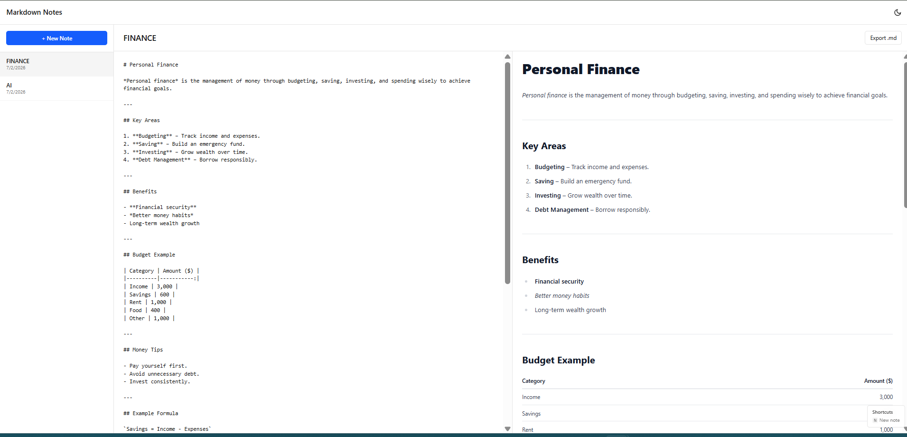
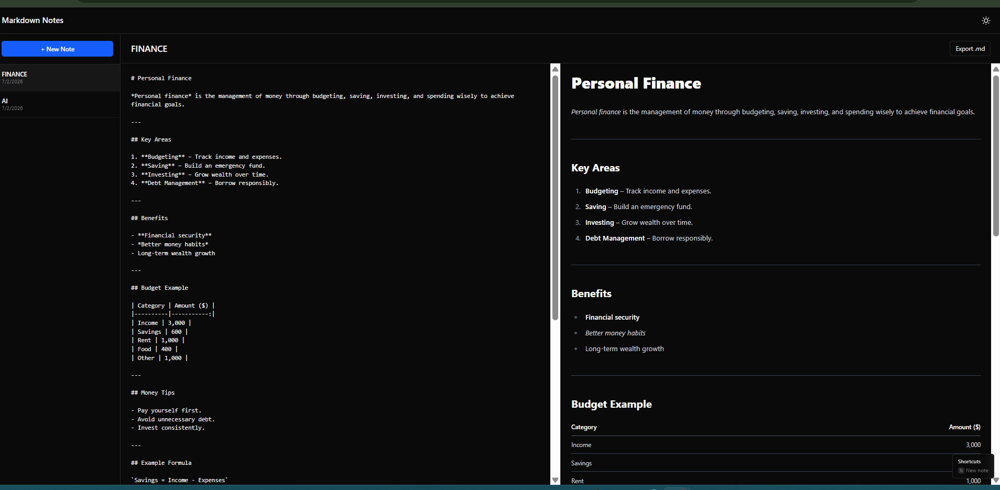
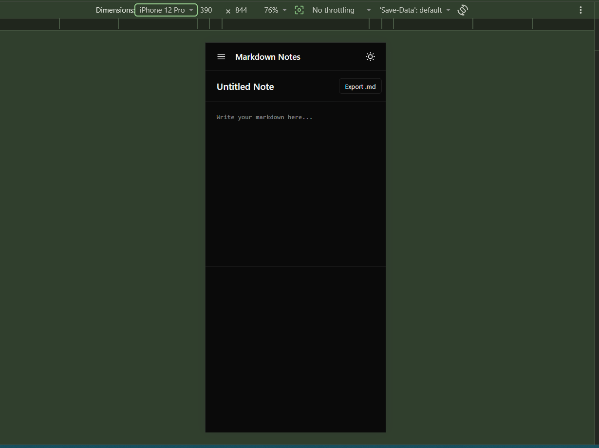
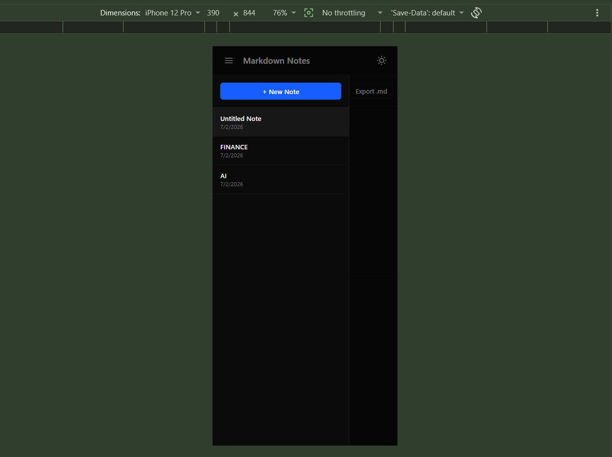
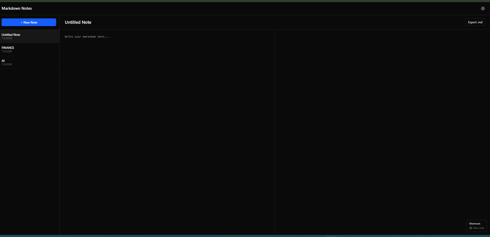

# Markdown Notes

A fast, responsive Markdown note-taking app with live preview, dark mode, and local persistence.

**[Live Demo](https://markdown-notes-app-alpha.vercel.app
)** · **[Report a bug](../../issues)**



## Features

- **Live Markdown preview** — write raw Markdown on the left, see it rendered instantly on the right
- **GitHub-Flavored Markdown** support — tables, task lists, strikethrough
- **Syntax-highlighted code blocks** in the preview
- **Create, rename, and delete** notes
- **Autosave** to `localStorage` — notes persist across page refreshes, no save button needed
- **Dark / light mode** with system preference detection
- **Fully responsive** — collapsible drawer sidebar on mobile, stacked panes for narrow screens
- **Export notes** as standalone `.md` files
- **Keyboard shortcut** — press `N` to create a new note instantly

## Screenshots

| Light Mode | Dark Mode |
|---|---|
|  |  |

| Mobile View | Mobile Drawer |
|---|---|
|  |  |



## Tech Stack

- **React 18** + **TypeScript**
- **Vite** — build tool and dev server
- **Tailwind CSS v4** — utility-first styling, CSS-based configuration
- **Zustand** — lightweight global state management
- **react-markdown** + **remark-gfm** + **rehype-highlight** — Markdown rendering with GFM support and syntax highlighting
- **Vitest** + **React Testing Library** — unit and component testing
- **GitHub Actions** — CI pipeline running lint, tests, and build on every push
- **Vercel** — deployment

## Getting Started

### Prerequisites

- Node.js 18+
- npm

### Installation

```bash
git clone https://github.com/davidtiger3622/markdown-notes-app.git
cd markdown-notes-app
npm install
```

### Development

```bash
npm run dev
```

Open `http://localhost:5173` in your browser.

### Testing

```bash
npm run test
```

### Linting

```bash
npm run lint
```

### Build for production

```bash
npm run build
```

## Project Structure

```
src/
├── components/         # UI components
│   ├── tests/          # Component tests
│   ├── Editor.tsx
│   ├── Header.tsx
│   ├── Sidebar.tsx
│   └── ShortcutsHint.tsx
├── hooks/               # Custom React hooks
│   └── useKeyboardShortcut.ts
├── store/               # Zustand stores
│   ├── tests/           # Store tests
│   ├── notesStore.ts
│   └── themeStore.ts
├── App.tsx
└── main.tsx
```

## Key Design Decisions

- **Zustand over Context/Redux** — minimal boilerplate for a project this size, while still demonstrating proper global state patterns (selectors, persisted state).
- **Autosave over manual save** — every keystroke syncs to `localStorage`, so there's no risk of losing work and no unnecessary UI friction.
- **`key` prop remount pattern** — the editor uses `key={activeNoteId}` to force a clean remount when switching notes, avoiding a `useEffect`-based state sync anti-pattern flagged by React's `eslint-plugin-react-hooks`.
- **CSS-only responsive drawer** — the mobile sidebar uses Tailwind's `translate-x` utilities instead of an animation library, keeping the bundle small.

## CI/CD

Every push to `main` triggers a GitHub Actions workflow that:
1. Installs dependencies
2. Runs ESLint
3. Runs the full test suite
4. Builds the production bundle

This ensures the app is always in a deployable, working state.

## License

This project is licensed under the MIT License — see the [LICENSE](LICENSE) file for details.

## Author

**David Wafula**
GitHub: [@davidtiger3622](https://github.com/davidtiger3622)
